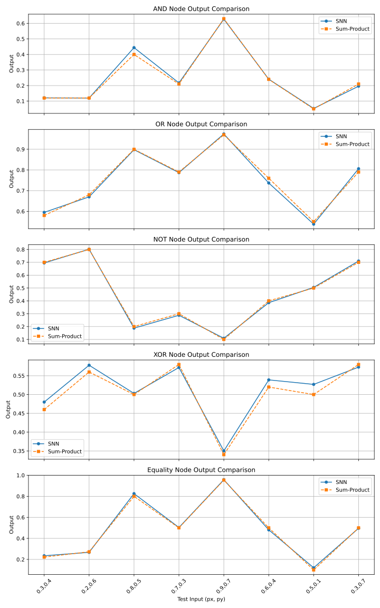

# stdp-bernoulli-message-passing

This repository contains the implementation for the paper:

**"Spike-Timing-Dependent Plasticity for Bernoulli Message Passing"**

---

## 📖 Description
In this work, we use **Spike-Timing-Dependent Plasticity (STDP)** to train networks of spiking neurons based on **Leaky Integrate-and-Fire (LIF) models**.  
The trained networks are able to perform basic logical operations such as:

- **AND**
- **OR**
- **NOT**

By combining these trained nodes, we also implement more complex operations, including:

- **Equality (marginalization)**
- **XOR**

Finally, we compare the performance of these STDP-trained spiking networks with numerical results, as illustrated in the figure below:

---

## 📂 Contents
- `src/` – Core implementation  
- `data/` – Stored results and trained weights 
- `figures/` – Plots and visual results  
- `README.md` – Project description  

